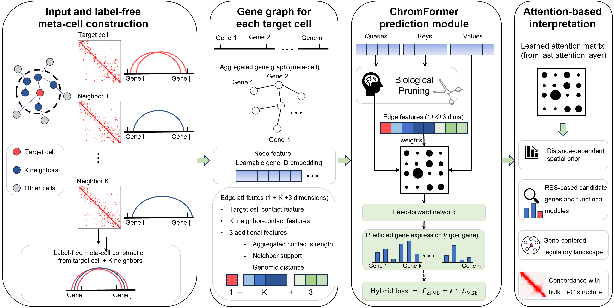

# ChromFormer



ChromFormer is a graph-transformer framework for predicting single-cell RNA expression from single-cell Hi-C derived gene-gene interaction graphs.

The current public version is centered on a ready-to-run mouse brain `chr19` example. The default configuration already points to this setup.

## Overview

- Input: single-cell Hi-C based gene-gene graphs
- Task: node-level regression for gene expression prediction
- Model: biologically inspired graph transformer (`ChromFormerPredictor`)
- Default released example: mouse brain, `chr19`

## Repository Structure

```text
ChromFormer-main/
|- configs/
|  `- train_config.py
|- data/
|  |- brain/
|  |  |- metadata/
|  |  |- genes/
|  |  |- labels/                  # local processed labels
|  |  `- metacell_graphs/         # local processed graph files
|  |- embryo/
|  `- shared/
|- fig/
|- model.py
|- utils.py
|- train.py
|- test.py
`- requirement.txt
```

## Environment Setup


### create a new environment

```bash
conda create -n chromformer python=3.11 -y
conda activate chromformer
pip install -r requirement.txt
```

## Data Layout

The released code expects processed files to be organized as:

- `data/<dataset>/genes/`
- `data/<dataset>/labels/`
- `data/<dataset>/metadata/`
- `data/<dataset>/metacell_graphs/<chromosome>/`

The default example uses:

- dataset: `brain`  # brain  embryo
- chromosome: `chr19`
- mouse brain processed dataset download: `https://drive.google.com/file/d/15PAFI6_BrdbGalIlExJsRv8WAPeD8oud/view?usp=sharing`

For example, the default graph directory is:

- `data/brain/metacell_graphs/chr19/`

That directory should contain one `.npz` graph file per cell.

After downloading the mouse brain example package, place the processed files into the corresponding `data/brain/` subdirectories used by this repository.

Important note:

- large processed datasets, archives, and full label matrices are not versioned in this repository
- you should place your local processed files under the paths above before running training or inference
- example brain `chr19` checkpoints are included under `outputs/train_brain_chr19_topk20/models/`

## Configuration

The default configuration file is:

- [configs/train_config.py](configs/train_config.py)

The current defaults are:

- `DATASET_NAME = "brain"`
- `CHROMOSOME = "chr19"`
- `TOP_K = 20`

If your local data follows the same directory layout, you can usually run the default example without editing the config.

## Training

Run:

```bash
python train.py
```

Or explicitly specify a config:

```bash
python train.py --config configs/train_config.py
```

Training will:

- load the graph manifest and graph files
- split cells into train, validation, and test sets by predefined cell types
- train the model and select the best checkpoint using validation PCC
- evaluate the best checkpoint on the test set
- save predictions, labels, and metrics

### Default outputs

The default output directory is:

- `outputs/train_brain_chr19_topk20/`

Important files include:

- `models/best_model.pth`
- `models/last_model.pth`
- `results/test_metrics.json`
- `results/test_predictions.npy`
- `results/test_targets.npy`
- `results/test_predictions_log.npy`
- `results/test_targets_log.npy`
- `results/test_labels.pkl`
- `logs/resolved_config.json`
- `logs/run_summary.json`

### Saved evaluation metrics

Both training-time test evaluation and standalone inference save only these five metrics:

- `test_target_pcc`
- `test_target_scc`
- `test_target_mae`
- `test_target_mse`
- `test_target_rmse`

## Inference

To evaluate a saved checkpoint:

```bash
python test.py
```

By default, this will:

- load `configs/train_config.py`
- load the best checkpoint from the configured output directory
- run inference on the test split
- save the same five metrics and prediction arrays

To use a custom checkpoint:

```bash
python test.py --checkpoint outputs/train_brain_chr19_topk20/models/best_model.pth
```

To use a custom config:

```bash
python test.py --config configs/train_config.py
```

## Notes

- This release is currently centered on the `brain chr19` example.
- The current public code assumes normalized targets produced by `log1p -> clip -> scale`.
- If you change dataset or chromosome, make sure the corresponding metadata, labels, gene tables, and graph files exist under `data/`.

## Citation

If you use this repository in your work, please cite the corresponding ChromFormer paper or project release once available.
